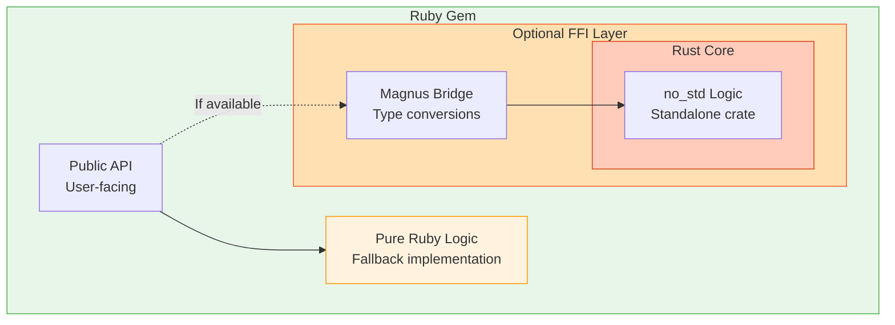

# FFI Hybrid Pattern

**Ruby gem with optional Rust acceleration via FFI, graceful fallback to pure Ruby.**

---

## Overview

The FFI Hybrid pattern creates a Ruby gem that:
1. Has a **pure Ruby implementation** (works everywhere)
2. Has a **Rust FFI layer** (optional speedup when available)
3. **Automatically chooses** the best implementation at runtime
4. Has a **`no_std` Rust core** (can compile to embedded targets)



---

## When to Use

### ✅ Perfect For
- Compute-heavy algorithms (parsing, crypto, math)
- Hot paths called thousands of times
- Code where algorithm is identical in Ruby and Rust
- Gems that need embedded compatibility

### ❌ Don't Use For
- Network-bound tasks (latency >> CPU time)
- Pure metaprogramming (no compute work)
- Simple wrappers around system commands
- Code with complex Ruby-specific semantics

---

## Architecture

### Layer 1: Pure Ruby Implementation

**Purpose:** Fallback that works everywhere (JRuby, no Cargo, etc.)

**Example (`lib/my_gem/executor.rb`):**
```ruby
module MyGem
  class Executor
    def initialize(base_delay:, multiplier:, max_delay:)
      @base_delay = base_delay
      @multiplier = multiplier
      @max_delay = max_delay
    end

    def calculate_delay(attempt)
      base = @base_delay * (@multiplier ** (attempt - 1))
      [base, @max_delay].min * (1 + rand)
    end
  end
end
```

**Requirements:**
- Must be fully functional (no stubs)
- Should be idiomatic Ruby
- Performance is acceptable but not optimal

---

### Layer 2: Rust Core (no_std)

**Purpose:** Portable, reusable implementation

**Structure:**
```
ext/my_gem_native/
├── Cargo.toml (workspace)
└── core/
    ├── Cargo.toml
    └── src/
        └── lib.rs
```

**Example (`ext/my_gem_native/core/src/lib.rs`):**
```rust
#![no_std]

pub struct Policy {
    pub base_delay_ms: u64,
    pub multiplier: f64,
    pub max_delay_ms: u64,
}

impl Policy {
    pub fn calculate_delay(&self, attempt: u8, random: f64) -> u64 {
        let exp = attempt.saturating_sub(1) as i32;
        let base = (self.base_delay_ms as f64) * self.multiplier.powi(exp);
        let capped = base.min(self.max_delay_ms as f64);
        (capped * (1.0 + random)) as u64
    }
}
```

**Key points:**
- `#![no_std]` = compiles to embedded targets
- No heap allocation in hot paths
- Pure functions (no side effects)
- Standalone crate (publishable to crates.io)

**Cargo.toml:**
```toml
[package]
name = "my-gem-core"
version = "0.1.0"
edition = "2021"

[features]
default = []
std = []

[dependencies]
# Only no_std compatible crates
```

---

### Layer 3: FFI Bridge (Magnus)

**Purpose:** Convert between Ruby and Rust types

**Structure:**
```
ext/my_gem_native/
├── ffi/
    ├── Cargo.toml
    └── src/
        └── lib.rs
```

**Example (`ext/my_gem_native/ffi/src/lib.rs`):**
```rust
use magnus::{function, Error, Ruby};
use my_gem_core::Policy;

fn calculate_delay_native(
    attempt: i64,
    base_delay: f64,      // Ruby Float (seconds)
    multiplier: f64,
    max_delay: f64,
    random: f64,
) -> f64 {
    let attempt_u8 = attempt.clamp(1, 255) as u8;

    let policy = Policy {
        base_delay_ms: (base_delay * 1000.0) as u64,  // Convert to ms
        multiplier,
        max_delay_ms: (max_delay * 1000.0) as u64,
    };

    let delay_ms = policy.calculate_delay(attempt_u8, random);
    delay_ms as f64 / 1000.0  // Convert back to seconds
}

#[magnus::init]
fn init(ruby: &Ruby) -> Result<(), Error> {
    let module = ruby.define_module("MyGemNative")?;
    module.define_module_function("calculate_delay", function!(calculate_delay_native, 5))?;
    Ok(())
}
```

**Cargo.toml:**
```toml
[package]
name = "my_gem_native"
version = "0.1.0"
edition = "2021"

[lib]
crate-type = ["cdylib"]

[dependencies]
my-gem-core = { path = "../core", features = ["std"] }
magnus = { version = "0.7", features = ["embed"] }
```

**Key points:**
- Type conversions happen here (Ruby ↔ Rust)
- Error handling (Ruby exceptions)
- Keep logic minimal (just bridging)

---

### Layer 4: Build System

**Purpose:** Compile Rust extension, handle failures gracefully

**File (`ext/my_gem_native/extconf.rb`):**
```ruby
# frozen_string_literal: true

# Skip on JRuby (no FFI support)
if RUBY_ENGINE == 'jruby'
  puts 'Skipping native extension on JRuby'
  puts 'MyGem will use pure Ruby backend'
  File.write('Makefile', "all:\n\t@echo 'Skipping'\ninstall:\n\t@echo 'Skipping'\n")
  exit 0
end

# Check Cargo availability
def cargo_available?
  system('cargo --version > /dev/null 2>&1')
end

unless cargo_available?
  warn 'WARNING: Cargo not found!'
  warn 'MyGem will fall back to pure Ruby.'
  File.write('Makefile', "all:\n\t@echo 'Skipping'\ninstall:\n\t@echo 'Skipping'\n")
  exit 0
end

# Build with rb-sys
require 'rb_sys/mkmf'

create_rust_makefile('my_gem_native/my_gem_native') do |r|
  r.ext_dir = 'ffi'
  r.profile = ENV.fetch('RB_SYS_CARGO_PROFILE', :release).to_sym
end
```

**Gemspec (`my_gem.gemspec`):**
```ruby
Gem::Specification.new do |spec|
  spec.name = 'my_gem'
  spec.version = '1.0.0'

  spec.files = Dir.glob(%w[
    lib/**/*.rb
    ext/**/*.{rb,rs,toml}
  ]).select { |f| File.exist?(f) }

  # Conditional extension (skip on JRuby)
  spec.extensions = ['ext/my_gem_native/extconf.rb'] unless RUBY_ENGINE == 'jruby'

  spec.add_dependency 'rb_sys', '~> 0.9'
end
```

---

### Layer 5: Fallback Mechanism

**Purpose:** Automatically use Rust if available, Ruby otherwise

**File (`lib/my_gem/native_speedup.rb`):**
```ruby
# frozen_string_literal: true

# Attempt to load native speedup
begin
  require 'my_gem_native/my_gem_native'

  # Suppress redefinition warnings
  original_verbosity = $VERBOSE
  $VERBOSE = nil

  module MyGem
    class Executor
      private

      # Override with native implementation
      def calculate_delay(attempt)
        MyGemNative.calculate_delay(
          attempt,
          @base_delay,
          @multiplier,
          @max_delay,
          rand
        )
      end
    end
  end

  $VERBOSE = original_verbosity

  # Optional: log success
  # MyGem.logger&.debug('Native speedup loaded')

rescue LoadError => e
  # Native extension not available (JRuby, no Cargo, compilation failed)
  # Silently fall back to pure Ruby

  # Optional: log fallback
  # MyGem.logger&.debug('Using pure Ruby backend')
ensure
  $VERBOSE = original_verbosity if defined?(original_verbosity)
end
```

**Load it at end of executor (`lib/my_gem/executor.rb`):**
```ruby
module MyGem
  class Executor
    # ... pure Ruby implementation ...
  end
end

# Load optional speedup
begin
  require_relative 'native_speedup'
rescue LoadError
  # Native not available, pure Ruby stays
end
```

**Key points:**
- `begin/rescue LoadError` = graceful fallback
- Monkey-patching = zero overhead if native not loaded
- Silent failure = user sees no difference

---

## Step-by-Step Implementation

### Step 1: Pure Ruby First

**DO NOT START WITH RUST.** Get the Ruby version working and tested.

```ruby
# lib/my_gem.rb
module MyGem
  def self.process(input)
    # Your algorithm here
  end
end

# test/my_gem_test.rb
class MyGemTest < Minitest::Test
  def test_process
    assert_equal expected, MyGem.process(input)
  end
end
```

**Run tests:** `bundle exec rake test`

**Profile:** `ruby -rprofile test/benchmark.rb`

**Identify hot paths:** Methods called >1000 times

---

### Step 2: Create Rust Core (no_std)

```bash
mkdir -p ext/my_gem_native/core/src
cd ext/my_gem_native
cargo init --lib core
```

**Edit `core/Cargo.toml`:**
```toml
[package]
name = "my-gem-core"
version = "0.1.0"
edition = "2021"

[features]
default = []
std = []
```

**Edit `core/src/lib.rs`:**
```rust
#![no_std]

// Port your Ruby algorithm here
pub fn process(input: u32) -> u32 {
    // Same logic as Ruby
}

#[cfg(test)]
mod tests {
    use super::*;

    #[test]
    fn test_process() {
        assert_eq!(process(42), expected_output);
    }
}
```

**Test Rust:** `cargo test --manifest-path ext/my_gem_native/core/Cargo.toml`

---

### Step 3: Create FFI Layer

```bash
cd ext/my_gem_native
cargo init --lib ffi
```

**Edit `ffi/Cargo.toml`:**
```toml
[package]
name = "my_gem_native"
version = "0.1.0"
edition = "2021"

[lib]
crate-type = ["cdylib"]

[dependencies]
my-gem-core = { path = "../core", features = ["std"] }
magnus = "0.7"
```

**Edit `ffi/src/lib.rs`:**
```rust
use magnus::{define_module, function, Error};

fn process_native(input: i64) -> i64 {
    my_gem_core::process(input as u32) as i64
}

#[magnus::init]
fn init() -> Result<(), Error> {
    let module = define_module("MyGemNative")?;
    module.define_module_function("process", function!(process_native, 1))?;
    Ok(())
}
```

---

### Step 4: Add Build Configuration

**Create `ext/my_gem_native/Cargo.toml` (workspace):**
```toml
[workspace]
members = ["core", "ffi"]
resolver = "2"

[workspace.dependencies]
my-gem-core = { path = "./core" }
```

**Create `ext/my_gem_native/extconf.rb`:**
```ruby
# (See "Layer 4: Build System" above)
```

**Update gemspec:**
```ruby
spec.extensions = ['ext/my_gem_native/extconf.rb'] unless RUBY_ENGINE == 'jruby'
spec.add_dependency 'rb_sys', '~> 0.9'
```

---

### Step 5: Add Fallback Loader

**Create `lib/my_gem/native_speedup.rb`:**
```ruby
# (See "Layer 5: Fallback Mechanism" above)
```

**Require at end of main file:**
```ruby
# lib/my_gem.rb
require_relative 'my_gem/version'
require_relative 'my_gem/executor'
# ... other requires ...

# Load optional speedup
begin
  require_relative 'my_gem/native_speedup'
rescue LoadError
  # Pure Ruby fallback
end
```

---

### Step 6: Test Both Paths

**Test pure Ruby:**
```bash
# Disable native extension temporarily
mv ext/my_gem_native ext/my_gem_native.bak
bundle exec rake test
mv ext/my_gem_native.bak ext/my_gem_native
```

**Test with native:**
```bash
bundle exec rake compile
bundle exec rake test
```

**Test on JRuby:**
```bash
rbenv shell jruby-9.4.0.0
bundle install
bundle exec rake test
```

---

### Step 7: Benchmark

**Create `test/benchmark.rb`:**
```ruby
require 'benchmark/ips'
require 'my_gem'

Benchmark.ips do |x|
  x.report('ruby') do
    # Force pure Ruby by calling private method
    MyGem::Executor.new(args).send(:calculate_delay, 5)
  end

  x.report('native') do
    # Uses native if available
    MyGem::Executor.new(args).calculate_delay(5)
  end

  x.compare!
end
```

**Run:**
```bash
bundle exec ruby test/benchmark.rb
```

**Expected output:**
```
Comparison:
              native:  1000000.0 i/s
                ruby:    15384.6 i/s - 65.00x slower
```

---

## Common Patterns

### Pattern 1: Simple Function

**Ruby:**
```ruby
def parse(input)
  # parsing logic
end
```

**Rust core:**
```rust
pub fn parse(input: &str) -> Vec<Token> {
    // same logic
}
```

**FFI:**
```rust
fn parse_native(input: String) -> Vec<String> {
    my_gem_core::parse(&input)
        .into_iter()
        .map(|t| t.to_string())
        .collect()
}
```

---

### Pattern 2: Method on Class

**Ruby:**
```ruby
class Parser
  def initialize(config)
    @config = config
  end

  def parse(input)
    # use @config
  end
end
```

**Rust core:**
```rust
pub struct Parser {
    pub config: Config,
}

impl Parser {
    pub fn parse(&self, input: &str) -> Vec<Token> {
        // use self.config
    }
}
```

**FFI:**
```rust
#[magnus::wrap(class = "MyGem::Parser")]
struct ParserWrapper {
    inner: Parser,
}

impl ParserWrapper {
    fn parse(&self, input: String) -> Vec<String> {
        self.inner.parse(&input)
            .into_iter()
            .map(|t| t.to_string())
            .collect()
    }
}
```

---

### Pattern 3: Error Handling

**Ruby:**
```ruby
def process(input)
  raise ArgumentError, "Invalid input" if input.nil?
  # ...
rescue SomeError => e
  raise ProcessError, e.message
end
```

**Rust core:**
```rust
pub fn process(input: Option<u32>) -> Result<u32, ProcessError> {
    let input = input.ok_or(ProcessError::InvalidInput)?;
    // ...
}
```

**FFI:**
```rust
fn process_native(input: Option<i64>) -> Result<i64, Error> {
    let result = my_gem_core::process(input.map(|i| i as u32))
        .map_err(|e| Error::new(exception::runtime_error(), e.to_string()))?;
    Ok(result as i64)
}
```

---

## Troubleshooting

### Native Extension Won't Compile

**Check:**
1. Cargo installed? `cargo --version`
2. Rust version? `rustc --version` (need 1.70+)
3. rb-sys gem? `gem list rb_sys`

**Debug:**
```bash
cd ext/my_gem_native
cargo build --manifest-path ffi/Cargo.toml
```

---

### LoadError on require

**Possible causes:**
1. Extension not compiled (`bundle exec rake compile`)
2. Wrong Ruby version (need 3.0+)
3. Missing dependencies

**Debug:**
```ruby
begin
  require 'my_gem_native/my_gem_native'
rescue LoadError => e
  puts "Load error: #{e.message}"
  puts "Paths searched: #{$LOAD_PATH}"
end
```

---

### Type Conversion Errors

**Common issue:** Ruby Float vs Rust f64 precision

**Solution:** Explicitly convert in FFI layer
```rust
fn calculate_native(value: f64) -> f64 {
    let precise = value as f64;  // Ensure f64
    let result = core::calculate(precise);
    result as f64  // Ensure Ruby gets f64
}
```

---

## Publishing

### 1. Test All Platforms

```bash
# CRuby with native
bundle exec rake test

# JRuby (pure Ruby)
rbenv shell jruby
bundle exec rake test

# TruffleRuby
rbenv shell truffleruby
bundle exec rake test
```

---

### 2. Publish Rust Crate

```bash
cd ext/my_gem_native/core
cargo publish
```

Now your Rust crate is on [crates.io](https://crates.io) and usable by pure Rust projects!

---

### 3. Publish Ruby Gem

```bash
gem build my_gem.gemspec
gem push my_gem-1.0.0.gem
```

Users installing the gem will:
- Automatically compile native extension (if Cargo available)
- Fall back to pure Ruby (if compilation fails)

---

## Real-World Example: ChronoMachines

See the reference implementation: [github.com/state-machines/chrono_machines](https://github.com/state-machines/chrono_machines)

**Stats:**
- 65x speedup on retry delay calculations
- `no_std` core (compiles to ESP32)
- Works on JRuby (pure Ruby fallback)
- Rust crate published to crates.io

**Usage:**
```ruby
# Works everywhere
ChronoMachines.retry(max_attempts: 5, base_delay: 0.1) do
  risky_operation
end

# Fast when native available, correct always
```

---

## Next Steps

1. Read [SYNTAX.md](SYNTAX.md) for Ruby→Rust translation guide
2. Study `examples/chrono_machines/` for reference
3. Use `templates/ffi_hybrid/` to bootstrap your gem
4. Join discussions about your implementation

**Remember:** Start with Ruby. Measure. Port hot paths. Keep fallback. Ship it.
