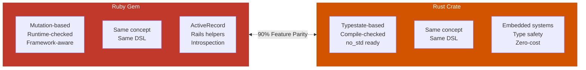

# Mirror API Pattern

**Parallel Ruby and Rust implementations with 90%+ conceptual parity, NO FFI integration.**

---

## Overview

The Mirror API pattern creates:
1. **Ruby gem** with idiomatic Ruby semantics
2. **Rust crate** with idiomatic Rust semantics
3. **Same conceptual API** (90%+ feature parity)
4. **No code sharing** (independent implementations)
5. **Language-specific optimizations** (each leverages its strengths)



---

## When to Use

### ✅ Perfect For

- **Different ownership semantics** (mutation vs consumption)
- **Type safety matters** (compile-time guarantees in Rust)
- **Educational projects** (teaching Rust via familiar Ruby patterns)
- **Dual-target libraries** (Rails + Embedded)
- **Framework integration** (Ruby needs ORM hooks, Rust needs bare-metal)

### ❌ Don't Use For

- **Identical algorithms** (use FFI Hybrid instead)
- **Simple speedups** (FFI is easier)
- **Can't maintain parity** (divergent features over time)

---

## When Mirror > FFI Hybrid

### Use Mirror API when FFI would destroy value:

**Example: State Machines**

**Rust typestate pattern:**
```rust
let vehicle: Vehicle<Parked> = Vehicle::new(());
let vehicle: Vehicle<Idling> = vehicle.ignite().unwrap();
// ^^^ Type changed! Compiler prevents calling .park() on Parked state
```

**Why FFI breaks this:**
- FFI can't preserve type information across boundary
- Rust's compile-time guarantees become runtime checks
- The whole point (type safety) is lost

**Solution:** Mirror API
- Ruby uses runtime state machine (idiomatic)
- Rust uses typestate (compile-time safety)
- Same conceptual API, different enforcement

---

## Architecture

### Ruby Side

**Structure:**
```
my_state_machine/
├── lib/
│   ├── my_state_machine.rb
│   ├── my_state_machine/
│   │   ├── machine.rb          # Core state machine
│   │   ├── transition.rb       # Transition logic
│   │   ├── event.rb            # Event handling
│   │   ├── callback.rb         # Hooks (before/after/around)
│   │   └── integrations/       # Rails, ActiveRecord, etc.
│   └── ...
└── test/
```

**Design:**
- Object-oriented (classes, methods)
- Metaprogramming (`define_method`, DSL magic)
- Runtime state (`@state` instance variable)
- Framework integrations (ActiveRecord callbacks)

---

### Rust Side

**Structure:**
```
my-state-machine-rs/
├── my-state-machine-core/      # no_std traits & types
│   └── src/
│       └── lib.rs
├── my-state-machine-macro/     # Procedural macro for DSL
│   └── src/
│       ├── lib.rs
│       ├── parser.rs
│       └── codegen/
│           ├── typestate.rs    # Compile-time state types
│           └── dynamic.rs      # Runtime dispatch
└── my-state-machine/           # Public API
    └── src/
        └── lib.rs
```

**Design:**
- Macro-based code generation
- PhantomData for type-level state
- Zero-cost abstractions (optimizes away)
- `no_std` compatible (embedded ready)

---

## Feature Parity Matrix

| Feature | Ruby | Rust | Notes |
|---------|------|------|-------|
| **Core** |
| States & transitions | ✅ | ✅ | Same concept |
| Initial state | ✅ | ✅ | Same syntax |
| Multiple machines | ✅ | ✅ | Ruby: same object, Rust: separate types |
| **Guards** |
| `if` guards | ✅ | ✅ | Ruby: `:if`, Rust: `guards: [...]` |
| `unless` guards | ✅ | ✅ | Ruby: `:unless`, Rust: `unless: [...]` |
| Multiple guards | ✅ | ✅ | All must pass |
| **Callbacks** |
| `before_transition` | ✅ | ✅ | Same behavior |
| `after_transition` | ✅ | ✅ | Same behavior |
| `around_transition` | ✅ | ✅ | Same behavior |
| Callback ordering | ✅ | ✅ | Defined order |
| **Events** |
| Event payloads | ✅ | ✅ | Pass data to callbacks |
| Event chaining | ✅ | ✅ | Sequential transitions |
| Failed transitions | ✅ | ✅ | Ruby: raises, Rust: `Result` |
| **Advanced** |
| Async support | ✅ | ✅ | Ruby: Fiber, Rust: tokio |
| Hierarchical states | ✅ | ✅ | Nested states |
| Parallel states | ✅ | ✅ | Multiple active |
| **Divergent** |
| ActiveRecord integration | ✅ | ❌ | Ruby-specific |
| Compile-time type safety | ❌ | ✅ | Rust-specific |
| Dynamic state graphs | ✅ | ❌ | Ruby runtime flexibility |
| `no_std` embedded | ❌ | ✅ | Rust bare-metal |

**Parity: ~90%** (same concepts, language-appropriate implementations)

---

## API Comparison

### Basic State Machine

**Ruby:**
```ruby
require 'state_machines'

class Vehicle
  state_machine :state, initial: :parked do
    event :ignite do
      transition parked: :idling
    end

    event :shift_up do
      transition idling: :first_gear
    end

    before_transition parked: :idling do |vehicle|
      vehicle.check_fuel
    end
  end

  def check_fuel
    raise "Out of fuel!" unless @fuel > 0
  end
end

# Usage
vehicle = Vehicle.new
vehicle.state         # => "parked"
vehicle.ignite        # => true (mutates @state)
vehicle.state         # => "idling"
```

**Rust:**
```rust
use state_machines::state_machine;

state_machine! {
    name: Vehicle,
    initial: Parked,
    states: [Parked, Idling, FirstGear],
    events {
        ignite {
            before: [check_fuel],
            transition: { from: Parked, to: Idling }
        },
        shift_up {
            transition: { from: Idling, to: FirstGear }
        }
    }
}

fn check_fuel(_ctx: &Vehicle<(), Parked>) -> Result<(), String> {
    if fuel > 0 {
        Ok(())
    } else {
        Err("Out of fuel!".into())
    }
}

// Usage
let vehicle = Vehicle::new(());                  // Type: Vehicle<(), Parked>
let vehicle = vehicle.ignite().unwrap();         // Type: Vehicle<(), Idling>
// vehicle consumed, new instance returned with different type
```

**Key differences:**
- **Ruby:** Mutation (same object, `@state` changes)
- **Rust:** Consumption (old instance consumed, new instance with different type)
- **Both:** Same event names, same conceptual flow

---

### Guards

**Ruby:**
```ruby
state_machine :status, initial: :idle do
  event :start do
    transition idle: :running, if: :ready?
  end

  event :pause do
    transition running: :paused, unless: :critical?
  end
end

def ready?
  @preparation_complete && !@blocked
end

def critical?
  @priority == :high
end
```

**Rust:**
```rust
state_machine! {
    name: Task,
    initial: Idle,
    events {
        start {
            guards: [ready],
            transition: { from: Idle, to: Running }
        },
        pause {
            unless: [critical],
            transition: { from: Running, to: Paused }
        }
    }
}

fn ready(ctx: &Task<Context, Idle>) -> bool {
    ctx.data.preparation_complete && !ctx.data.blocked
}

fn critical(ctx: &Task<Context, Running>) -> bool {
    ctx.data.priority == Priority::High
}
```

**Parity:** ✅ Same logic, different syntax

---

### Callbacks with Payloads

**Ruby:**
```ruby
state_machine :connection, initial: :disconnected do
  event :connect do
    transition disconnected: :connected
  end

  after_transition disconnected: :connected do |conn, transition|
    conn.log("Connected with: #{transition.args.first}")
  end
end

# Usage
conn.connect("192.168.1.1")
# Logs: "Connected with: 192.168.1.1"
```

**Rust:**
```rust
state_machine! {
    name: Connection,
    initial: Disconnected,
    events {
        connect {
            after: [log_connection],
            transition: { from: Disconnected, to: Connected }
        }
    }
}

fn log_connection(ctx: &Connection<IpAddr, Connected>) {
    println!("Connected with: {}", ctx.data);
}

// Usage
let conn = Connection::new("192.168.1.1".parse().unwrap());
let conn = conn.connect().unwrap();
// Prints: "Connected with: 192.168.1.1"
```

**Parity:** ✅ Same callbacks, different passing mechanism

---

### Async Events

**Ruby (with Fiber):**
```ruby
require 'async'

state_machine :job, initial: :pending, async: true do
  event :start do
    transition pending: :running
  end

  after_transition pending: :running do |job|
    job.perform_async
  end
end

# Usage
Async do
  job.start_async.wait
end
```

**Rust (with tokio):**
```rust
state_machine! {
    name: Job,
    initial: Pending,
    async: true,
    events {
        start {
            after: [perform_async],
            transition: { from: Pending, to: Running }
        }
    }
}

async fn perform_async(_ctx: &Job<(), Running>) {
    // Async work
}

// Usage
#[tokio::main]
async fn main() {
    let job = Job::new(());
    let job = job.start().await.unwrap();
}
```

**Parity:** ✅ Both support async

---

## Implementation Guide

### Step 1: Design the API

**Start with Ruby DSL** (it's more expressive):
```ruby
state_machine :name, initial: :start_state do
  event :event_name do
    transition from_state: :to_state, if: :guard?
  end

  before_transition from_state: :to_state do |obj|
    # callback logic
  end
end
```

**Document:**
- States (list all)
- Events (transitions they trigger)
- Guards (conditions)
- Callbacks (timing, purpose)
- Payloads (data passed to events)

---

### Step 2: Implement Ruby Side

**Core machine (`lib/state_machine/machine.rb`):**
```ruby
module StateMachine
  class Machine
    attr_reader :name, :initial_state, :states, :events

    def initialize(name, initial:)
      @name = name
      @initial_state = initial
      @states = {}
      @events = {}
    end

    def event(name, &block)
      @events[name] = Event.new(name, &block)
    end

    def transition(from:, to:, **options)
      Transition.new(from: from, to: to, **options)
    end
  end
end
```

**Integration with classes:**
```ruby
module StateMachine
  module DSL
    def state_machine(name, initial:, &block)
      machine = Machine.new(name, initial: initial)
      machine.instance_eval(&block)

      # Generate methods on the class
      machine.events.each do |event_name, event|
        define_method(event_name) do |*args|
          # Execute transition with guards/callbacks
        end
      end
    end
  end
end

class MyClass
  extend StateMachine::DSL

  state_machine :status, initial: :idle do
    # ...
  end
end
```

---

### Step 3: Implement Rust Side

**Core traits (`state-machine-core/src/lib.rs`):**
```rust
#![no_std]

pub trait MachineState {
    type Context;
    type State;

    fn current_state(&self) -> &Self::State;
}

pub trait Transition {
    type From;
    type To;
    type Error;

    fn transition(self) -> Result<Self::To, (Self::From, Self::Error)>;
}
```

**Macro for DSL (`state-machine-macro/src/lib.rs`):**
```rust
use proc_macro::TokenStream;
use quote::quote;
use syn::{parse_macro_input, DeriveInput};

#[proc_macro]
pub fn state_machine(input: TokenStream) -> TokenStream {
    let ast = parse_macro_input!(input as StateMachineDef);

    // Parse DSL
    let name = &ast.name;
    let initial = &ast.initial;
    let states = &ast.states;
    let events = &ast.events;

    // Generate code
    let state_types = generate_state_types(states);
    let event_methods = generate_event_methods(events);

    let expanded = quote! {
        #state_types

        pub struct #name<D, S> {
            data: D,
            _state: PhantomData<S>,
        }

        impl<D> #name<D, #initial> {
            pub fn new(data: D) -> Self {
                Self {
                    data,
                    _state: PhantomData,
                }
            }
        }

        #event_methods
    };

    TokenStream::from(expanded)
}
```

---

### Step 4: Maintain Parity

**Test suite mirroring:**

Ruby test → Rust test (same behavior)

**Ruby (`test/vehicle_test.rb`):**
```ruby
def test_ignition_transitions_to_idling
  vehicle = Vehicle.new
  assert_equal :parked, vehicle.state

  vehicle.ignite
  assert_equal :idling, vehicle.state
end
```

**Rust (`tests/vehicle_test.rs`):**
```rust
#[test]
fn test_ignition_transitions_to_idling() {
    let vehicle = Vehicle::new(());
    // Type is Vehicle<(), Parked>

    let vehicle = vehicle.ignite().unwrap();
    // Type is now Vehicle<(), Idling>
}
```

**Same test name, same behavior, different assertions** (Ruby runtime, Rust types)

---

### Step 5: Document Divergences

**Create `DIFFERENCES.md` in each repo:**

```markdown
# Ruby vs Rust Differences

## State Representation
- **Ruby:** `@state` instance variable (Symbol)
- **Rust:** Type parameter (PhantomData<State>)

## Ownership
- **Ruby:** Mutation (same object)
- **Rust:** Consumption (old → new)

## Error Handling
- **Ruby:** Raises exceptions
- **Rust:** Returns `Result<NewState, (OldState, Error)>`

## Framework Integration
- **Ruby:** ActiveRecord, ActiveModel
- **Rust:** N/A (generic traits)

## Dynamic Behavior
- **Ruby:** Can add states at runtime
- **Rust:** States fixed at compile-time
```

---

## Real-World Example: state_machines

**Ruby gem:** [github.com/state-machines/state_machines](https://github.com/state-machines/state_machines)
**Rust crate:** [github.com/state-machines/state-machines-rs](https://github.com/state-machines/state-machines-rs)

**Stats:**
- 90%+ feature parity
- Ruby: 7,050 LOC (OOP + metaprogramming)
- Rust: 39,711 LOC (macro generation + type system)
- Same DSL feel, different enforcement

**Ruby strengths:**
- ActiveRecord persistence
- Multiple machines on one object
- Runtime-defined state graphs
- Introspection (`vehicle.state_transitions`)

**Rust strengths:**
- Compile-time state validation
- Zero runtime overhead (optimizes away)
- `no_std` embedded support
- Impossible to call invalid transitions (type error)

---

## Design Principles

### 1. Start with Ruby

Ruby's expressiveness makes it ideal for API design:
```ruby
event :ignite do
  transition parked: :idling, if: :fuel_available?
end
```

**Then translate to Rust:**
```rust
ignite {
    guards: [fuel_available],
    transition: { from: Parked, to: Idling }
}
```

---

### 2. Embrace Divergence

**Don't force parity when it doesn't make sense.**

**Ruby-only feature:**
```ruby
# Multiple state machines on one object
class Order
  state_machine :payment_status, initial: :pending do
    # ...
  end

  state_machine :shipment_status, initial: :preparing do
    # ...
  end
end
```

**Rust equivalent:** Two separate types
```rust
struct Order {
    payment: PaymentMachine<Pending>,
    shipment: ShipmentMachine<Preparing>,
}
```

**Different implementation, same capability.**

---

### 3. Maintain Conceptual Parity

**Core concepts must map 1:1:**
- States exist in both
- Transitions work the same way
- Guards have same logic
- Callbacks fire at same times
- Events have same names

**Implementation details can differ:**
- Ruby uses classes, Rust uses types
- Ruby mutates, Rust consumes
- Ruby raises, Rust returns Result

---

### 4. Document Learning Path

**In Ruby README:**
```markdown
## Rust Version

A Rust implementation with compile-time type safety is available:
[state-machines-rs](https://github.com/state-machines/state-machines-rs)

If you know this Ruby API, you already understand 90% of the Rust API.
```

**In Rust README:**
```markdown
## Ruby Version

A Ruby gem with the same conceptual API is available:
[state_machines](https://github.com/state-machines/state_machines)

Use the Ruby version to prototype, then port to Rust for type safety.
```

---

## Benefits

### For Ruby Developers
- ✅ Learn Rust through familiar patterns
- ✅ Prototype in Ruby, deploy in Rust (if needed)
- ✅ Understand type systems via examples

### For Rust Developers
- ✅ See how Ruby handles same problems
- ✅ Appreciate compile-time guarantees
- ✅ Learn DSL design from Ruby

### For Projects
- ✅ Rails app uses Ruby version (ActiveRecord integration)
- ✅ Embedded device uses Rust version (`no_std`)
- ✅ Same conceptual model in both places

---

## When Mirror API Wins

**Scenario:** IoT project with Rails dashboard and ESP32 sensors

**Ruby (dashboard):**
```ruby
class Sensor < ApplicationRecord
  state_machine :status, initial: :idle do
    event :activate do
      transition idle: :active
    end
  end
end

# Persists to database, triggers webhooks, logs to Rails logger
sensor.activate
```

**Rust (ESP32):**
```rust
state_machine! {
    name: Sensor,
    initial: Idle,
    events {
        activate {
            transition: { from: Idle, to: Active }
        }
    }
}

// Runs on microcontroller, no_std, compile-time checked
let sensor = Sensor::new(());
let sensor = sensor.activate().unwrap();
```

**Same state machine logic, two targets, zero code duplication.**

---

## Next Steps

1. Study Ruby implementation to understand API
2. Design Rust types that mirror Ruby classes
3. Implement Rust macro to generate code
4. Maintain test parity (same tests, different assertions)
5. Document divergences clearly

**Remember:** Mirror APIs prioritize conceptual parity over code reuse. Different implementations, same mental model.
