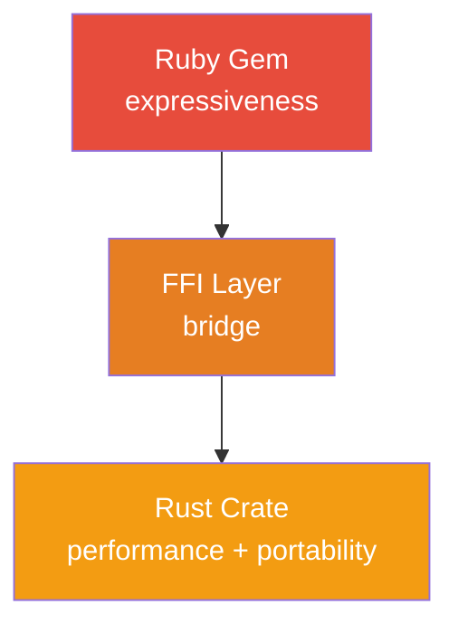
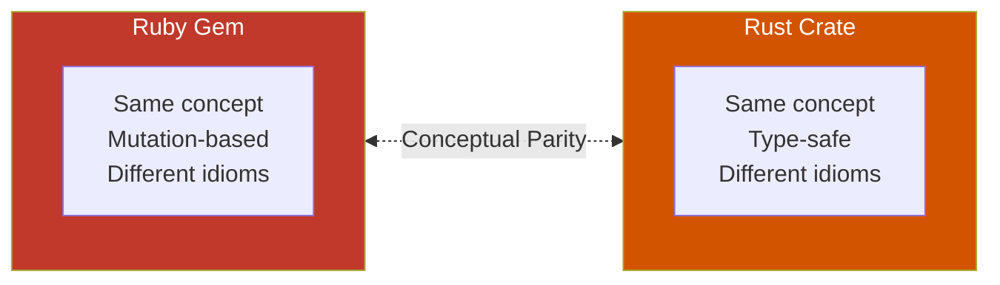

# The Matryoshka Philosophy

## The Problem

Ruby is **beautifully expressive** but slow for compute-heavy tasks.
Rust is **blazingly fast** but has a steep learning curve.
Embedded systems require **C/bare-metal** knowledge.
**C extensions** create tightly-coupled code that can't be reused outside Ruby.

**Result:** Ruby developers hit a wall when they need:
- Performance (10-100x speedup)
- Embedded targets (ESP32, STM32)
- Reusable system libraries
- Type safety guarantees

Traditional solutions force you to choose: Ruby's expressiveness OR Rust's performance. Not both.

---

## The Solution

**Matryoshka patterns** let you have both by maintaining **conceptual identity across different forms**.

### Two Patterns, One Philosophy

**1. FFI Hybrid** - Nested dolls (Ruby wraps Rust)



**2. Mirror API** - Twin dolls (parallel implementations)



Both patterns share core principles:
- **Conceptual parity** (same design, different expression)
- **Educational value** (Ruby devs learn Rust accidentally)
- **Independent utility** (Rust crate is a real library, not just extension code)

---

## The Real Workflow: Ruby for Thinking, Rust for Deploying

This isn't just about performance or portability—it's about **creative flow**.

### When Ideas Strike

You get an idea. It's clustering in your head. You need to prototype **fast**.

**Ruby is your thinking tool:**
- Faster than writing it in natural English
- No strict structure—write code in any order
- Easy to debug and inspect
- Rotate and refactor instantly
- No compiler screaming about types

**The flow:**
```
1. Idea strikes → Write in Ruby (minutes to hours)
2. Debug, inspect, rotate → Ruby REPL is your playground
3. Refactor → Keep it clean and working
4. Idea stabilizes → Now you know what you're building
5. Port to Rust → Production-ready, embedded-ready
```

### The Embedded Problem

You're building IoT/embedded systems (ESP32, STM32, etc.). You need the **same logic** to run:
- On your server (Ruby app)
- On microcontrollers (Rust firmware)

**Bad solutions:**
- ❌ HTTP calls from ESP32 to Ruby app (latency, network dependency)
- ❌ MicroPython on ESP32 (heavy, slow, limited)
- ❌ Rewrite everything in C (throw away your Ruby prototype)

**Matryoshka solution:**
- ✅ Prototype in Ruby (fast iteration)
- ✅ Port stable logic to Rust `no_std` crate
- ✅ Ruby gem uses it via FFI (server-side)
- ✅ ESP32 uses same crate directly (embedded)
- ✅ One codebase, three deployment targets

### Why Not Go? (Lessons Learned)

**History:** This pattern evolved from years of using Go + Ruby.

**Go problems:**
1. **Two garbage collectors in one process** - Ruby has a GC, Go has a GC. They compete for resources, cause unpredictable pause times, and don't coordinate. Memory overhead doubles.
2. **No crate concept** - Go modules aren't standalone libraries
3. **Awkward structure** - Go code doesn't live naturally in gem root
4. **No FFI ecosystem** - Harder to bridge Ruby ↔ Go
5. **No `no_std`** - Can't easily target bare-metal

**Rust advantages:**
1. **No garbage collector** - Rust uses compile-time ownership. Zero GC overhead, zero pause times, no runtime conflicts with Ruby's GC.
2. **Crates are real libraries** - Publishable, reusable, independent
3. **Natural structure** - `ext/gem_native/core/` is a proper crate
4. **Magnus FFI** - Seamless Ruby ↔ Rust bridge
5. **`no_std` support** - Compiles to ESP32 out of the box

**Result:** Rust + Ruby is what Go + Ruby tried to be.

---

## Core Principles

### 1. Performance is Optional, Not Required

**Traditional thinking:**
"This is slow, I must rewrite it in Rust/C."

**Matryoshka thinking:**
"This works at 1x speed. At 65x speed, it's amazing. But if Rust isn't available, 1x is still acceptable."

**Why this matters:**
- JRuby users get pure Ruby (no FFI)
- Cargo missing? No problem (graceful fallback)
- Development speed prioritized over runtime speed

**Example (ChronoMachines):**
```ruby
# This code ALWAYS works
ChronoMachines.retry(max_attempts: 5) { risky_operation }

# Under the hood:
# - JRuby: Pure Ruby (1x speed)
# - CRuby + Cargo: Rust FFI (65x speed)
# - User sees identical behavior
```

---

### 2. Embedded is Free

**Traditional path:**
1. Write Ruby logic
2. Need embedded version
3. Rewrite everything in C
4. Maintain two codebases forever

**Matryoshka path:**
1. Write Ruby gem with FFI Hybrid pattern
2. Rust core is already `no_std` compatible
3. Compile same core to ESP32
4. One codebase, three targets (Ruby/Server/Embedded)

**Example:**
```rust
// This code runs in THREE places:
// 1. Ruby gem (via FFI)
// 2. Pure Rust projects (as crate dependency)
// 3. ESP32 firmware (no_std)

pub fn calculate_delay(&self, attempt: u8, jitter: f64) -> u64 {
    let exp = attempt.saturating_sub(1) as i32;
    let base = self.base_delay_ms as f64 * self.multiplier.powi(exp);
    base.min(self.max_delay_ms as f64) as u64
}
```

**No C. No duplication. Just Rust.**

---

### 3. Learning is Implicit

**The secret:** Ruby and Rust share more syntax than you think.

By **intentionally mirroring** Ruby idioms in Rust, developers learn Rust as a side effect of reading code.

**Ruby:**
```ruby
def calculate_delay(attempts)
  base = @base_delay * (@multiplier ** (attempts - 1))
  [base, @max_delay].min * (1 + rand)
end
```

**Rust (intentionally similar):**
```rust
fn calculate_delay(&self, attempts: u8) -> f64 {
    let base = self.base_delay * self.multiplier.powi((attempts - 1) as i32);
    base.min(self.max_delay) * (1.0 + rng.gen())
}
```

**What you learn in 30 seconds:**
- `let` = variable binding
- `fn name(&self, param: Type) -> Type` = method signature
- `.powi()` = power with integer exponent
- `.min()` = same as Ruby
- Last expression is return value (like Ruby!)

**After reading 3-4 methods:** You understand 40% of Rust syntax.

**After porting one gem:** You can read most Rust code confidently.

**After porting three gems:** You're writing idiomatic Rust.

**This is not a tutorial. This is osmosis.**

---

### 4. Readability Over Cleverness

**We reject:**
- ❌ JavaScript-style method chaining (`.fetch().then().products()`)
- ❌ "Clever" APIs that require reading docs to understand
- ❌ One-liner solutions that sacrifice clarity
- ❌ Implicit behavior that surprises users

**We require:**
- ✅ Explicit variable bindings (`let delay = ...`)
- ✅ Ruby-like naming conventions (`calculate_delay`, not `calc_dly`)
- ✅ Self-documenting code (names explain intent)
- ✅ Clear data flow (no magic)

**Example of BAD code (too clever):**
```rust
// ❌ Don't do this
pub fn retry<F, T>(f: F) -> T
where F: Fn() -> Result<T, Box<dyn Error>> {
    (0..3).find_map(|i| f().ok()
        .or_else(|| { thread::sleep(Duration::from_millis(100 << i)); None }))
        .expect("max retries")
}
```

**Example of GOOD code (clear):**
```rust
// ✅ Do this
pub fn retry<F, T>(f: F, max_attempts: u8) -> Result<T, RetryError>
where F: Fn() -> Result<T, Box<dyn Error>> {
    let mut attempts = 0;

    loop {
        attempts += 1;

        match f() {
            Ok(result) => return Ok(result),
            Err(error) => {
                if attempts >= max_attempts {
                    return Err(RetryError::MaxAttemptsExceeded { attempts, error });
                }

                let delay_ms = calculate_delay(attempts);
                thread::sleep(Duration::from_millis(delay_ms));
            }
        }
    }
}
```

**Why the second is better:**
- Named variables explain intent
- Explicit loop structure (not hidden in iterators)
- Clear error handling
- Easy to add logging/debugging
- Ruby developer can read it immediately

---

### 5. The Crate is a First-Class Citizen

**This is the key difference from C extensions.**

**Traditional C extensions:**
```
pg, trilogy, mysql2 gems
└── ext/*.c (tightly coupled to Ruby, not reusable)
```

**Matryoshka pattern:**
```
chrono_machines gem
├── lib/*.rb (Ruby implementation)
└── ext/chrono_machines_native/
    ├── ffi/ (Ruby bindings via Magnus)
    └── core/ (STANDALONE RUST CRATE)
              ↓
         Can be published to crates.io
              ↓
         Used by pure Rust projects
              ↓
         Compiles to embedded targets
```

**The Rust crate has independent value:**
- ✅ Published to [crates.io](https://crates.io) as `chrono-machines`
- ✅ Used in CLI tools, servers, embedded devices
- ✅ Ruby gem is just ONE consumer among many
- ✅ Rust developers get a real library, not "extension code"

**Example:** `chrono-machines` crate can be used in:
1. Ruby gems (via FFI)
2. Rust web servers (Axum, Actix)
3. CLI tools (retry logic)
4. ESP32 firmware (embedded retry)
5. WebAssembly (browser-side retries)

**One library. Five targets. Zero duplication.**

---

## When to Use Each Pattern

### FFI Hybrid Pattern

**Use when:**
- ✅ Algorithm is identical in Ruby and Rust
- ✅ Need significant speedup (10-100x)
- ✅ Want embedded compatibility
- ✅ Ownership semantics align (no complex borrowing)

**Examples:**
- Retry logic with exponential backoff
- Parsers (JSON, XML, CSV)
- Cryptography (hashing, encoding)
- Math-heavy algorithms
- String manipulation

**Don't use when:**
- ❌ Network-bound tasks (latency dominates CPU)
- ❌ Pure metaprogramming (ActiveSupport)
- ❌ Simple wrappers (no compute work)

---

### Mirror API Pattern

**Use when:**
- ✅ Ownership semantics differ (mutation vs consumption)
- ✅ FFI would destroy type safety
- ✅ Each language has unique strengths to leverage
- ✅ Educational value (teaching Rust via Ruby)

**Examples:**
- State machines (typestate pattern in Rust)
- Protocol implementations (different semantics)
- Framework integrations (Rails vs embedded)
- DSLs with language-specific features

**Don't use when:**
- ❌ Algorithm is identical (use FFI Hybrid instead)
- ❌ Can't maintain feature parity (too divergent)
- ❌ No clear benefit to parallel implementations

---

## Success Metrics

A Matryoshka gem/crate is successful when:

### Technical Metrics
1. **Performance:** ≥10x speedup on hot paths (FFI Hybrid)
2. **Portability:** Compiles to `no_std` targets (FFI Hybrid core)
3. **Fallback:** Works on JRuby/unsupported platforms (graceful degradation)
4. **Readability:** Ruby dev can read Rust without docs (~40% syntax coverage)
5. **Independence:** Rust crate has value outside Ruby ecosystem

### Community Metrics
1. **Learning:** Ruby devs report understanding Rust better
2. **Adoption:** Used in both Ruby gems AND pure Rust projects
3. **Maintenance:** Easy to contribute (clear, explicit code)
4. **Documentation:** Code is self-documenting (minimal comments needed)

---

## Anti-Patterns to Avoid

### 1. Premature Optimization
**Don't** start with Rust. Start with Ruby. Measure. THEN optimize hot paths.

**Bad:**
```
Day 1: "I'll write the whole gem in Rust with Ruby bindings"
Day 30: Still debugging FFI type conversions
```

**Good:**
```
Day 1: Pure Ruby implementation (works, tested)
Day 2: Profile and identify hot paths
Day 3: Port only the hot paths to Rust
Day 4: Ship with graceful fallback
```

### 2. Sacrificing Readability for Performance
**Don't** write "clever" Rust that's 2% faster but 200% harder to read.

**Remember:** The goal is **acceptable performance** AND **learning value**, not maximum performance.

### 3. Tight Coupling
**Don't** make the Rust crate depend on Ruby types or semantics.

**Bad:**
```rust
// ❌ Ruby-specific types in core
pub fn process(ruby_array: Vec<VALUE>) -> VALUE { ... }
```

**Good:**
```rust
// ✅ Generic Rust in core
pub fn process<T>(items: &[T]) -> Vec<T> { ... }

// ✅ FFI layer handles Ruby conversion
#[magnus::wrap]
fn process_ruby(ruby_array: RArray) -> RArray {
    let items: Vec<String> = ruby_array.to_vec()?;
    let results = core::process(&items);
    RArray::from_vec(results)
}
```

### 4. Ignoring the Fallback
**Don't** make the Rust version mandatory. Pure Ruby must work.

**Bad:**
```ruby
# ❌ Fails if native extension missing
require 'my_gem_native/my_gem_native'  # LoadError on JRuby
```

**Good:**
```ruby
# ✅ Graceful fallback
begin
  require 'my_gem_native/my_gem_native'
  NATIVE_AVAILABLE = true
rescue LoadError
  NATIVE_AVAILABLE = false
end
```

---

## Philosophy in Practice

### Case Study: ChronoMachines

**Problem:** Retry logic with exponential backoff is called thousands of times per second.

**Ruby implementation:** ~0.01ms per calculation
**Rust implementation:** ~0.00015ms per calculation
**Speedup:** 65x

**But the value isn't just speed:**

1. **Portability:** Same retry logic now runs on ESP32 (IoT devices)
2. **Learning:** Ruby devs learn Rust by reading the port
3. **Independence:** `chrono-machines` crate used in pure Rust projects
4. **Reliability:** Fallback works on JRuby (enterprise compatibility)

**Result:** One design, multiple benefits.

---

### Case Study: state_machines

**Problem:** State machine logic has different ownership models in Ruby vs Rust.

**Ruby:** Mutation-based (change `@state` in place)
**Rust:** Typestate-based (consume `Vehicle<Parked>`, return `Vehicle<Idling>`)

**Solution:** Mirror API pattern (90%+ feature parity, NO FFI)

**Value:**
1. **Type safety:** Rust compiler prevents invalid state transitions
2. **Familiarity:** Ruby devs recognize the DSL immediately
3. **Education:** Learn Rust's ownership model through familiar patterns
4. **Independence:** Each implementation optimized for its ecosystem

**Result:** Same concept, language-appropriate implementations.

---

## The Bigger Picture

Matryoshka isn't just about performance. It's about:

1. **Polyglot learning** - Understanding new languages through familiar patterns
2. **Code reuse** - Write once, use everywhere (server, embedded, CLI)
3. **Ecosystem bridges** - Ruby gems that are also Rust crates
4. **Graceful degradation** - Fast when possible, correct always
5. **Community building** - Ruby devs learning Rust, Rust devs learning Ruby

**The goal:** Make systems programming accessible to Ruby developers without sacrificing Ruby's expressiveness.

**The method:** Matryoshka dolls - same design, different scales, instantly recognizable.

---

## Next Steps

1. **Understand the patterns** → [FFI_HYBRID.md](FFI_HYBRID.md) and [MIRROR_API.md](MIRROR_API.md)
2. **Learn Rust syntax** → [SYNTAX.md](SYNTAX.md)
3. **Study examples** → `examples/` directory
4. **Build something** → Use templates to start your own gem

**Remember:** Start with Ruby. Measure. Optimize hot paths. Keep it readable. Ship with fallbacks.

**Welcome to Matryoshka.**
