# Matryoshka: Ruby ↔ Rust Design Patterns

**Build Ruby gems that learn Rust for free.**

Two design patterns for Ruby/Rust collaboration:
1. **FFI Hybrid** - Ruby wraps Rust for optional 10-100x speedup
2. **Mirror API** - Parallel Ruby/Rust implementations with conceptual parity

---

## Why "Matryoshka"?

**Matryoshka dolls** (Russian nesting dolls) share the same design across different scales. This repo's patterns embody that concept in two ways:

### Pattern 1: Nested Dolls (FFI Hybrid)


**Same logic, nested layers.** The Ruby API wraps FFI which wraps Rust. Each layer looks the same to the user.

### Pattern 2: Twin Dolls (Mirror API)


**Same design, parallel implementations.** Two independent projects that share the same conceptual API, each optimized for its language.

**Both are matryoshka** because they maintain **conceptual identity** across different forms—whether nested (FFI) or parallel (Mirror).

---

## Quick Start

### FFI Hybrid Pattern (ChronoMachines)

**What it does:** Ruby gem with optional Rust acceleration. Falls back to pure Ruby gracefully.

**Ruby usage:**
```ruby
# Works everywhere (no Cargo, compilation fails gracefully)
ChronoMachines.retry(max_attempts: 5, base_delay: 0.1) do
  risky_operation
end
```

**Under the hood:**
- Pure Ruby implementation (fallback)
- Rust FFI speedup (65x faster when available)
- `no_std` core (compiles to ESP32)

**When to use:** Compute-heavy code (parsing, crypto, math) where the algorithm is identical in both languages.

👉 **[Read FFI Hybrid Guide](FFI_HYBRID.md)**

---

### Mirror API Pattern (state_machines)

**What it does:** Two independent implementations (Ruby + Rust) with 90%+ feature parity, NO FFI.

**Ruby version:**
```ruby
state_machine :state, initial: :parked do
  event :ignite { transition parked: :idling }
end

vehicle.ignite      # Mutates in place
vehicle.state       # => "idling"
```

**Rust version:**
```rust
state_machine! {
    initial: Parked,
    events {
        ignite { transition: { from: Parked, to: Idling } }
    }
}

let v1 = Vehicle::new(());            // Type: Vehicle<Parked>
let v2 = v1.ignite().unwrap();        // Type: Vehicle<Idling>
// v1 consumed, v2 has different type
```

**When to use:** When ownership semantics differ (mutation vs. consumption), or when FFI would destroy type safety guarantees.

👉 **[Read Mirror API Guide](MIRROR_API.md)**

---

## Philosophy

### 1. Performance is Optional
If your Ruby code was "good enough" at 1x speed, it's **amazing** at 65x.

### 2. Embedded is Free
Write logic in Ruby → Compile Rust core to ESP32. No C required.

### 3. Learning is Implicit
Ruby devs read Rust ports → Understand 40% of Rust syntax by osmosis.

### 4. Readability Over Cleverness
- ✅ Explicit variable bindings
- ✅ Ruby-like method names
- ❌ No `.fetch().then().map()` chains
- ❌ No "clever" APIs that sacrifice clarity

👉 **[Read Philosophy](PHILOSOPHY.md)**

---

## Safety: Can It Segfault CRuby?

**Short answer:** The architecture makes segfaults extremely difficult.

**Why this is safer than C extensions:**

Traditional C extensions directly manipulate Ruby VM internals:
```c
// ❌ "Sus" C extension pattern
VALUE some_method(VALUE self) {
    rb_funcall(obj, rb_intern("method"), 0);  // Calling Ruby VM
    VALUE result = rb_str_new(...);            // Manual allocation
    RARRAY_PTR(ary)[i] = ...;                  // Direct pointer access
}
```

**Matryoshka FFI Hybrid pattern:**
```rust
// ✅ Rust core (no Ruby knowledge)
pub fn calculate_delay(&self, attempt: u8) -> u64 {
    // Pure math, no allocations, no Ruby types
}

// ✅ FFI layer (Magnus handles safety)
fn calculate_delay_native(attempt: i64) -> f64 {
    let result = core::calculate_delay(attempt as u8);
    result as f64  // Magnus converts safely
}
```

**Architecture guarantees:**

1. **No direct Ruby VM calls** - Magnus abstracts all `rb_*` functions
2. **No manual GC interaction** - Rust never touches Ruby's garbage collector
3. **Only primitives cross FFI boundary** - `i64`, `f64`, `String` (copied, not borrowed)
4. **Rust core is isolated** - `no_std` crate with no Ruby types
5. **Type conversions are explicit** - Magnus enforces compile-time safety

**Failure modes (and mitigations):**

| Scenario | C Extension | Matryoshka |
|----------|-------------|------------|
| Panic/crash | Segfault | Magnus catches, converts to Ruby exception |
| Bad type | Runtime crash | Compile-time error (Magnus type checking) |
| Memory leak | Easy (forget to free) | Impossible (Rust ownership) |
| GC bug | Holding pointers across GC | No Ruby heap access |
| Race condition | Undefined behavior | Document thread-safety (same as Ruby) |

**Compare to pg/mysql2/trilogy:**
Those gems call C libraries (`libpq`, `libmysqlclient`) and carefully manage Ruby GC, exceptions, and memory. Much larger "sus" surface area.

**Matryoshka's promise:** If the Rust core is `no_std` and only passes primitives across FFI, segfaults are **architecturally prevented**, not just "avoided by good coding."

**Real example (ChronoMachines):**
- Input: `i64`, `f64` (primitives from Ruby)
- Computation: Pure Rust math (no allocations, no Ruby VM)
- Output: `f64` (primitive to Ruby)
- **No way to segfault** - no pointers, no Ruby VM access, no GC interaction

---

## Pattern Decision Tree

```mermaid
flowchart TD
    Start[Need Ruby + Rust<br/>collaboration?]
    Q1{Same algorithm,<br/>just need speed?}
    Q2{Different semantics/<br/>ownership models?}

    FFI[Use FFI Hybrid]
    FFIBenefits[✅ Optional performance boost<br/>✅ Graceful fallback to pure Ruby<br/>✅ Share Rust core with embedded]

    Mirror[Use Mirror API]
    MirrorBenefits[✅ Language-appropriate idioms<br/>✅ Preserve type safety<br/>✅ Independent evolution]

    Start --> Q1
    Q1 -->|Yes| FFI
    FFI --> FFIBenefits
    Q1 -->|No| Q2
    Q2 -->|Yes| Mirror
    Mirror --> MirrorBenefits

    style FFI fill:#f39c12,stroke:#e67e22,color:#fff
    style Mirror fill:#d35400,stroke:#ba4a00,color:#fff
    style FFIBenefits fill:#fff3cd,stroke:#856404
    style MirrorBenefits fill:#f8d7da,stroke:#721c24
```



---

## Examples

### FFI Hybrid
- **[chrono_machines](https://github.com/seuros/chrono_machines)** - Retry logic with exponential backoff (reference implementation)
- `examples/simple_parser/` - Minimal string parsing example
- `examples/embedded_blinker/` - ESP32 using shared Rust core

### Mirror API
- **[state_machines](https://github.com/state-machines/state_machines)** (Ruby) + **[state-machines-rs](https://github.com/state-machines/state-machines-rs)** (Rust)
- Identical state machine DSL
- Ruby: ActiveRecord integration, runtime flexibility
- Rust: Compile-time type safety, embedded targets

---

## Learn Rust by Accident

**Ruby:**
```ruby
def calculate_delay(attempts)
  base = @base_delay * (@multiplier ** (attempts - 1))
  [base, @max_delay].min * (1 + rand)
end
```

**Rust (intentionally similar):**
```rust
fn calculate_delay(&self, attempts: u8) -> f64 {
    let base = self.base_delay * self.multiplier.powi((attempts - 1) as i32);
    base.min(self.max_delay) * (1.0 + rng.gen())
}
```

**What you learn:**
- `let` = variable binding
- `fn name(&self, param: Type) -> ReturnType` = method signature
- `.powi()` = integer exponent (like `**`)
- `.min()` = same as Ruby
- Last expression returns (no `return` needed)

After reading 3-4 ported methods, you understand **40% of Rust syntax**.

👉 **[Ruby→Rust Translation Guide](SYNTAX.md)**

---

## When to Use These Patterns

### ✅ Perfect For

**FFI Hybrid:**
- Parsers (JSON, XML, CSV, Markdown)
- String manipulation (regex, sanitization)
- Cryptography (hashing, encoding, JWT)
- Math-heavy algorithms (statistics, simulations)
- Date/time conversions

**Mirror API:**
- State machines (when type safety matters)
- Protocol implementations (different ownership models)
- Educational projects (teaching Rust via Ruby)
- Embedded + server dual-target libraries

### ❌ Don't Use For

- Pure metaprogramming gems (ActiveSupport)
- Network clients (latency dominates, not CPU)
- Simple wrappers around system commands
- Gems with < 3 compute-intensive methods

---

## Getting Started

1. **Understand the philosophy** → [PHILOSOPHY.md](PHILOSOPHY.md)
2. **Choose your pattern:**
   - FFI Hybrid → [FFI_HYBRID.md](FFI_HYBRID.md)
   - Mirror API → [MIRROR_API.md](MIRROR_API.md)
3. **Learn Rust syntax** → [SYNTAX.md](SYNTAX.md)
4. **Study examples** → `examples/` directory
5. **Use templates** → `templates/` directory

---

## Project Structure

```
matryoshka/
├── README.md                    # You are here
├── PHILOSOPHY.md                # Why this exists
├── FFI_HYBRID.md                # ChronoMachines pattern
├── MIRROR_API.md                # state_machines pattern
├── SYNTAX.md                    # Ruby→Rust cheatsheet
├── examples/
│   ├── chrono_machines/         # FFI Hybrid reference
│   ├── state_machines/          # Mirror API reference
│   ├── simple_parser/           # Minimal FFI example
│   └── embedded_blinker/        # ESP32 demo
└── templates/
    ├── ffi_hybrid/              # FFI pattern scaffolding
    └── mirror_api/              # Mirror pattern scaffolding
```

---

## Real-World Benefits

### ChronoMachines (FFI Hybrid)
- **65x faster** retry delay calculations
- **Graceful fallback** when native extension unavailable (Magnus uses C extensions, not supported by JRuby)
- Rust core compiles to **ESP32** (same retry logic in firmware)
- Zero changes to public API

### state_machines (Mirror API)
- **Ruby version:** 7,050 LOC, Rails integration, runtime flexibility
- **Rust version:** 39,711 LOC, compile-time type safety, `no_std` support
- **90%+ feature parity** despite different ownership models
- Ruby devs learning Rust via familiar patterns

---

## Contributing

We welcome:
- ✅ Example gems using these patterns
- ✅ Documentation improvements
- ✅ Embedded platform guides (ESP32, STM32, RP2040)
- ✅ Translation guides for other languages

We reject:
- ❌ "Clever" Rust code that's hard to read
- ❌ Breaking `no_std` compatibility in FFI Hybrid cores
- ❌ Performance-only optimizations that sacrifice clarity

---

## License

MIT (copy freely, attribution appreciated)

---

## Questions?

- **"Why not just use C extensions?"** → **C doesn't have the crate ecosystem.** In traditional C extensions (pg, trilogy, mysql2), the C code is tightly coupled to Ruby—it's just extension code, not a reusable library. With Matryoshka, the **Rust crate is a fully functional, standalone library** that can be published to [crates.io](https://crates.io) and used in pure Rust projects (embedded, CLI tools, other libraries). The Ruby gem is just ONE consumer of it. The crate has independent value beyond Ruby.

- **"Why not FFI for everything?"** → Some patterns (like typestate) lose their value across FFI. When ownership semantics differ fundamentally (Ruby's mutation vs Rust's consumption), parallel implementations (Mirror API) preserve language-specific guarantees that FFI would destroy.

- **"Why the Russian doll metaphor?"** → See [top of this README](#why-matryoshka). **TL;DR:** Matryoshka dolls share the same design across different scales—same concept for nested layers (FFI Hybrid) and parallel implementations (Mirror API).

- **"Can I use this in production?"** → Yes. ChronoMachines is production-tested with graceful fallbacks.

- **"Do I need to know Rust first?"** → No. Read Ruby code, then read Rust port side-by-side. Learn by comparison (~40% syntax coverage after 3-4 methods).

---

**Start here:** [PHILOSOPHY.md](PHILOSOPHY.md) → Understand the "why" before the "how"
